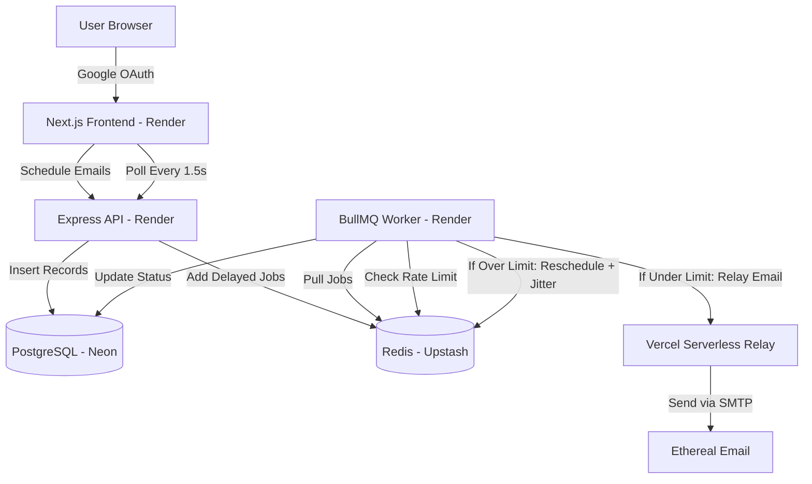

# ReachInbox Email Scheduler

<p align="center">
  
</p>

A high-performance email scheduling system built with **Next.js**, **Express**, **TypeScript**, **PostgreSQL**, **Redis**, and **BullMQ**. Features bulk CSV scheduling, per-sender hourly rate limiting, automatic rescheduling with jitter, per-user dashboard isolation, and a real-time monitoring UI.

🔗 **Live Demo**: [https://reach-inbox-frontends.onrender.com](https://reach-inbox-frontends.onrender.com)

🎥 **Video Demo**: [Watch on Google Drive](https://drive.google.com/file/d/1oxGlAYWOkuqffgMuSuDdEBSbXrp7Fr_q/view?usp=drivesdk)

---

## Features

- [x] **Bulk Scheduling via CSV**: Upload a list of recipients via CSV with automatic frontend parsing
- [x] **Configurable Delay & Rate Limit**: Set custom delay (seconds) between emails and max emails per hour directly from the UI
- [x] **Hourly Rate Limiting**: Redis-backed atomic counters limit sends per sender per hour. Excess emails auto-reschedule to the next hour with randomized jitter
- [x] **BullMQ Job Queue**: Delayed job queues with exact scheduling timestamps, stall detection, and automatic retry
- [x] **Concurrency Control**: Single-threaded worker with enforced minimum inter-send delays to prevent SMTP blacklisting
- [x] **Google OAuth Login**: NextAuth Google authentication with per-user dashboard isolation
- [x] **Per-User Dashboard**: Each Google account sees only their own emails — completely isolated
- [x] **Real-time Live Dashboard**: Separate Scheduled/Sent tabs with 1.5s auto-refresh and smooth Framer Motion animations
- [x] **Restart Survival**: PostgreSQL is the source of truth; Redis queues persist across restarts
- [x] **SMTP Relay Architecture**: Distributed email delivery via Vercel serverless functions to bypass hosting firewall restrictions
- [x] **Toast Notifications**: Interactive success/error toasts using `sonner`
- [x] **Load Test Script**: Zero-dependency script to schedule 1,000+ emails simultaneously

---

## Architecture



### How It Works

1. **User uploads a CSV** with recipient emails via the Compose Modal
2. **Backend creates DB records** for each email with status `scheduled` and adds BullMQ delayed jobs
3. **Worker picks up jobs** when their scheduled time arrives
4. **Rate limiter checks** Redis atomic counters — if under limit, proceeds; if over, reschedules to next hour with jitter
5. **Email is relayed** through a Vercel serverless function (bypasses Render's SMTP firewall)
6. **Status updates** flow back to PostgreSQL, and the frontend polls every 1.5s to show real-time progress

### Rate Limiting Strategy

- Redis keys: `rate_limit:<sender>:<yyyy-mm-dd-hh>` with 1-hour TTL
- Atomic `INCR` ensures no race conditions under concurrent workers
- When limit is hit: compute next hour + random jitter (0-5s) → `job.moveToDelayed()`
- Throws BullMQ's native `DelayedError()` for clean deferral

---

## Tech Stack

| Layer | Technology |
|-------|-----------|
| Frontend | Next.js 14, TypeScript, Tailwind CSS, Framer Motion |
| Auth | NextAuth.js + Google OAuth |
| Backend API | Express.js, TypeScript |
| Job Queue | BullMQ (Redis-backed) |
| Database | PostgreSQL (Neon) |
| Cache/Queue | Redis (Upstash) |
| Email | Nodemailer + Ethereal Email (test SMTP) |
| Hosting | Render (Frontend + Backend), Vercel (SMTP Relay) |

---

## Project Structure

```
├── backend/
│   ├── src/
│   │   ├── db.ts          # PostgreSQL connection (supports DATABASE_URL)
│   │   ├── index.ts       # Express API routes (schedule, list, reset)
│   │   ├── queue.ts       # BullMQ queue (supports REDIS_URL)
│   │   └── worker.ts      # BullMQ worker with rate limiting & relay
│   ├── docker-compose.yml # Local PostgreSQL + Redis containers
│   ├── init.sql           # Database schema
│   ├── load-test.js       # Stress test script (1000+ emails)
│   └── package.json
├── frontend/
│   ├── src/
│   │   ├── app/
│   │   │   ├── api/auth/   # NextAuth Google OAuth
│   │   │   ├── api/relay/  # Vercel SMTP relay endpoint
│   │   │   ├── dashboard/  # Protected dashboard page
│   │   │   └── page.tsx    # Landing page with Google login
│   │   ├── components/
│   │   │   ├── Header.tsx
│   │   │   ├── ComposeModal.tsx  # CSV upload + scheduling form
│   │   │   └── EmailsTable.tsx   # Real-time email status table
│   │   └── lib/api.ts     # Axios API client
│   └── package.json
└── README.md
```

---

## Local Development Setup

### Prerequisites
- Node.js v18.17+
- Docker & Docker Compose

### 1. Start Database & Redis
```bash
cd backend
docker-compose up -d
```

### 2. Backend
```bash
cd backend
cp .env.example .env   # Configure your env variables
npm install
npm start              # Terminal 1: API server on port 3000
npm run worker         # Terminal 2: BullMQ worker
```

### 3. Frontend
```bash
cd frontend
cp .env.example .env.local   # Configure your env variables
npm install
npm run dev                  # Starts on port 3002
```

### Environment Variables

**Backend (`backend/.env`)**:
```env
PORT=3000
DB_USER=user
DB_HOST=localhost
DB_NAME=email_scheduler
DB_PASSWORD=password
DB_PORT=5432
REDIS_HOST=localhost
REDIS_PORT=6379
SMTP_HOST=smtp.ethereal.email
SMTP_PORT=587
SMTP_USER=your_ethereal_user
SMTP_PASS=your_ethereal_pass
HOURLY_RATE_LIMIT=5
MIN_DELAY_MS=1000
```

**Frontend (`frontend/.env.local`)**:
```env
NEXT_PUBLIC_API_URL=http://localhost:3000
NEXTAUTH_SECRET=your_random_secret
GOOGLE_CLIENT_ID=your_google_client_id
GOOGLE_CLIENT_SECRET=your_google_client_secret
```

---

## Cloud Deployment

### Current Production Setup

| Service | Platform | URL |
|---------|----------|-----|
| Frontend | Render | https://reach-inbox-frontends.onrender.com |
| Backend API + Worker | Render | https://reach-inbox-w5dv.onrender.com |
| SMTP Relay | Vercel | https://reach-in-box-pied.vercel.app/api/relay |
| Database | Neon | PostgreSQL cloud instance |
| Queue/Cache | Upstash | Redis cloud instance |

### Deploy Your Own

1. **Database**: Create a free PostgreSQL on [Neon](https://neon.tech) and run `init.sql`
2. **Redis**: Create a free Redis on [Upstash](https://upstash.com)
3. **Backend**: Deploy to Render with `DATABASE_URL` and `REDIS_URL` env vars
4. **Frontend**: Deploy to Render with `NEXT_PUBLIC_API_URL` pointing to backend
5. **SMTP Relay**: Deploy frontend to Vercel as well for the `/api/relay` endpoint

---

## Load Testing

```bash
cd backend
npm run load-test
```

Schedules 1,000+ emails simultaneously. Watch the worker logs to see:
- First N emails sent successfully (where N = `HOURLY_RATE_LIMIT`)
- Remaining emails rate-limited and rescheduled to next hour with jitter

---

## Author

**Naveen S** — [LinkedIn](https://www.linkedin.com/in/naveen-s-b77a03343/) | [LeetCode](https://leetcode.com/u/Naveen_031)
